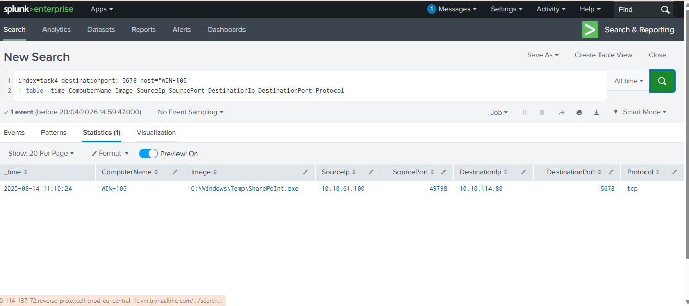
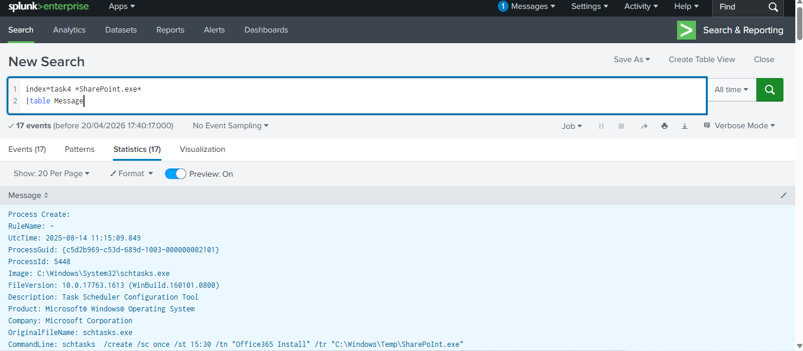

# Analysing Windows Logs(Syslog,WinEventLogs)-with Splunk SIEM.

## Overview

This report presents an investigation and analysis of Windows logs using Splunk. An alert was triggered for suspicious network activity on port 5678 from host WIN-105.
Further investigation using Splunk (`index=task4`) revealed the execution of a suspicious binary (`SharePoInt.exe`) from a temporary directory, combined with scheduled task persistence and outbound network communication to an internal IP (10.10.114.80).

The activity is assessed as malicious, indicating potential unauthorized execution and possible Command and Control behavior.

## Log Source

* SIEM: Splunk
* Index: `task4`
* Host: WIN-105
* Log Type: Microsoft-Windows-Sysmon/Operational

---

##  Investigation ;ueries

```spl
index=task4 destinationport=5678 host="WIN-105"
| table _time ComputerName Image SourceIp SourcePort DestinationIp DestinationPort Protocol
```

**Purpose:** Identify network connections over suspicious port 5678.
**Finding:** Connection established to **10.10.114.80**.

```spl
index=task4 "SharePoInt.exe"
| table Image CommandLine
```

**Purpose:** Extract process execution details including binary path and command-line arguments.
**Finding:** Shows execution from C:\Windows\Temp\SharePoInt.exe, indicating suspicious location and behavior.


##  Key Findings

### Suspicious Network Connection

* Destination IP: **10.10.114.80**
* Destination Port: **5678**
* Uncommon port →not standard Windows service
* Indicates potential **C2 communication or backdoor traffic**

---

###  Malicious Executable Detected

* File: `C:\Windows\Temp\SharePoInt.exe`
* Executed by user: **WIN-105\Ben Foster**
* Parent Process: `explorer.exe`
* Location: **Temp directory (highly suspicious)**

 The filename mimics legitimate software (**SharePoint**) but is misspelled(**SharePoInt**) →common attacker technique (**masquerading**)

---

### Process Creation (Sysmon Event ID 1)

* Process: `SharePoInt.exe`
* Command: `"C:\Windows\Temp\SharePoInt.exe"`
* Integrity Level: Medium
* Indicates direct user-level execution

---

### 4. Image Load

* Binary loaded from Temp directory
* File is **unsigned**
* Hashes:

  * MD5: `770D14FFA142F09730B415506249E7D1`
  * SHA256: `096A8CA80A730BD354334278700991EB762EBC8CB2E7D5CAED8702EC0EF2A912`

 **Unsigned executable with temp path indicates strong malicious indicator**

---


### Scheduled Task Activity Observed

Splunk logs revealed execution of `schtasks.exe` and `cmd.exe` related to the creation of a scheduled task:
**schtasks /create /sc once /st 15:30 /tn "Office365 Install" /tr "C:\Windows\Temp\SharePoInt.exe"**

```bash
schtasks /create /sc once /st 15:30 /tn  "Office365 Install" /tr "C:\Windows\Temp\SharePoInt.exe"

schtasks /create /sc onlogon /tn "Office365 Install" /tr "C:\Windows\Temp\SharePoInt.exe"

schtasks /create /sc onlogon /tn "Office365 Install" /tr "C:\Windows\Temp\SharePoInt.exe" /ru "Ben Foster"
```

## Timeline

| Time       | Event                                   |
| ---------- | --------------------------------------- |
| 11:10:22   | `SharePoInt.exe` executed               |
| 11:10:22   | Image loaded (Sysmon Event ID 7)        |
| [Time N/A] | Scheduled task created                  |
| [Time N/A] | Network connection to 10.10.114.80:5678 |

---

## Analysis

The investigation identified multiple strong indicators of compromise:

* Execution of **masquerading binary** (`SharePoInt.exe`)
* Located in **Temp directory**
* **Unsigned file**
* **Persistence via scheduled task**
* **Network communication over uncommon port (5678)**

This behavior strongly suggests:

* Malware execution
* Possible ** beaconing**
* Persistence mechanism for reexecution

---

## MITRE ATT&CK Mapping

* **T1036** – Masquerading
* **T1053.005** – Scheduled Task / Job
* **T1071** – Application Layer Protocol
* **T1105** – Ingress Tool Transfer
* **T1204** – User Execution

---

## Recommendations

*  Immediately isolate host **WIN-105**
*  Perform full forensic analysis on the system
*  Remove malicious scheduled task
*  Block IP **10.10.114.80** if not legitimate
*  Submit file hash to threat intelligence platforms like VirusTotal
*  Run full EDR/AV scan
* Investigate user **Ben foster** activity for compromise

---

## Conclusion

The activity observed on **WIN-105** is **confirmed malicious**.
The combination of masquerading executable, persistence , and suspicious network communication indicates a likely malware infection with potential command-and control behavior.

Immediate containment and remediation actions are required.

---
## Screenshots


