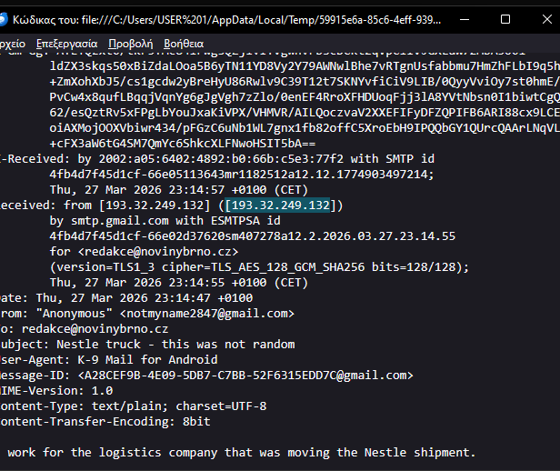
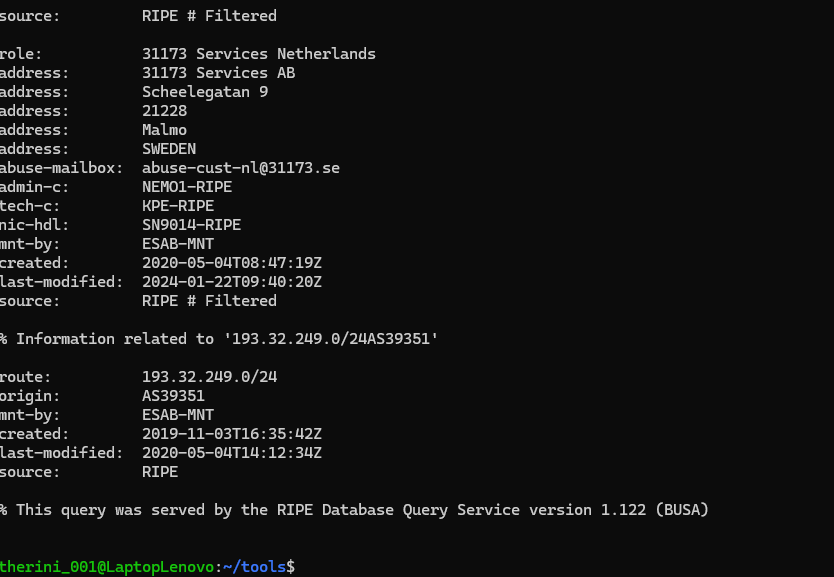
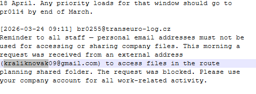

# OSINT Investigation Report - TryHackMe  
## Case: Internal Route File Data Leak

---

## 1. Executive Summary

This investigation was initiated following receipt of an anonymous email reporting suspicious after-hours access to internal route documentation prior to a scheduled freight departure.

The objectives of this investigation were to identify:

- The anonymous sender  
- The employee responsible for suspicious file activity  
- Potential route data exfiltration indicators  

Analysis findings indicate Employee **BR-0291** as the primary suspect responsible for unauthorized access and export of a sensitive route planning document.

**Overall Confidence Level: HIGH**

---

## 2. Scope

Artifacts analyzed during the investigation:

- Anonymous email (`.eml`)
- Email headers
- Access logs (`CSV`)
- Employee records (`CSV`)
- Internal communications (`PDF/TXT`)
- Truck image evidence

---

## 3. Methodology

The investigation followed a structured OSINT and digital forensics workflow:

1. Email Header Analysis  
2. Network Attribution & IP Intelligence  
3. Image & Location Verification  
4. Access Log Analysis  
5. Internal Communication Correlation  
6. Identity Pivoting & OSINT Enrichment  
7. Timeline Reconstruction  

---

## 4. Tools Used

- Thunderbird  
- Whois CLI  
- IPInfo  
- Google Reverse Image Search  
- Google Maps  
- Epieos  

---

## 5. Incident Timeline

### Confirmed Events (High Confidence)

| Timestamp | Event | Evidence Source | Assessment |
|---|---|---|---|
| 2026-03-19 16:58 | BR-0291 references updated route file and Q1 folder | Internal communications | Prior knowledge confirmed |
| 2026-03-24 07:11:03 | Failed authentication attempt on ROUTE_IT_PL_Q1_2026 | Access logs | Suspicious access attempt |
| 2026-03-24 09:51:07 | Successful access to route file | Access logs | Access achieved |
| 2026-03-25 10:05:22 | Re-access of route file | Access logs | Persistent access behavior |
| 2026-03-25 22:14:09 | EXPORT of ROUTE_IT_PL_Q1_2026.pdf | Access logs | Potential exfiltration |

### Correlated Events (Medium Confidence)

| Event | Source | Assessment |
|---|---|---|
| Sender IP 193.32.249.132 identified | Email headers | VPN / hosting infrastructure |
| Night-time activity reported | Anonymous email | Correlates with logs |
| Truck last seen in Hulín, Czechia | Image OSINT | Physical route confirmation |
| Internal visibility of system activity | Employee records | Supports insider claim |

---

## 6. Technical Findings

### 6.1 Email Header Analysis

```text
193.32.249.132
```

- VPN / proxy infrastructure detected  
- Origin anonymized  

---

### 6.2 IP Intelligence

```text
AS39351 - 31173 Services AB
Amsterdam, Netherlands
```

**Assessment: LOW TRACEABILITY**

- Datacenter IP  
- Hosting provider ASN  
- Abuse flagged  

---

### 6.3 Image Intelligence

```text
Kroměřížská 1281, Hulín, Czechia
```

- Matches last known truck location  
- Confirms geographic consistency  

---

### 6.4 Access Log Analysis

```text
2026-03-25 22:14:09
BR-0291
EXPORT → ROUTE_IT_PL_Q1_2026.pdf
```

**Assessment: HIGH RISK EVENT**

- Export action not expected for role behavior  
- Consistent with data exfiltration pattern  

---

## 7. Attack Chain (Behavioral Flow)

```text
Initial Probe → Authentication Failure → Access Gained → File Review → Repeated Access → Export (Exfiltration)
```

**Assessment: HIGH CONFIDENCE ATTACK SEQUENCE**

---

## 8. Attribution Analysis

Based on correlation of access logs, internal communications, and artifact analysis, Employee **BR-0291** is assessed as the most probable actor responsible for unauthorized access to the target route file.

This assessment is supported by:

- An initial failed authentication attempt against the target file
- Subsequent successful access to the same document
- Repeated interaction with related operational files
- Export activity involving the sensitive route document
- Prior demonstrated knowledge of file location and folder structure

Additionally, analysis of the anonymous email content suggests the sender possessed internal operational visibility and awareness of after-hours system activity.

Cross-referencing employee records indicates **BR-0312** as the most likely anonymous reporting party, based on role alignment and access visibility.

**Attribution Confidence: HIGH**

---

### Secondary Actor (Reporting Source)

Employee **BR-0312** is assessed as the likely source of the anonymous report.

**BR-0312 – Dispatch Operator (Brno / Olomouc)**  
Email: br0312@transeuro-log.cz  

**Confidence Level: MEDIUM**

---

## 9. Impact Assessment

- Unauthorized access to sensitive logistics route data  
- Potential exposure of operational freight planning  
- Risk of route intelligence leakage prior to departure  
- Possible insider activity within dispatch environment  

---

## 10. Indicators of Compromise

### IP Address
```text
193.32.249.132
```

### Files
```text
ROUTE_IT_PL_Q1_2026.pdf
DRIVER_SCHEDULE_WK13.xlsx
```

### Email Accounts
```text
br0291@transeuro-log.cz
br0312@transeuro-log.cz
```

### Location
```text
Hulín, Czechia
```

---

## 11. Conclusion

The investigation indicates with high confidence that **BR-0291** conducted unauthorized access and export of sensitive route planning data.


The activity pattern is consistent with deliberate data exfiltration behavior.

**Final Confidence: HIGH**


## 10. Appendix - Evidence Artifacts

### A.1 Email Header


Source IP: `193.32.249.132`  
Identified as VPN / hosting infrastructure

---

### A.3 IP Intelligence



AS39351 - 31173 Services AB  
Datacenter / hosting provider (VPN suspected)

---

### A.4 Location Verification


Truck last seen in Hulín, Czechia

---

### A.5 OSINT Lookup


External email footprint discovered  
Possible identity correlation (unconfirmed)

---
