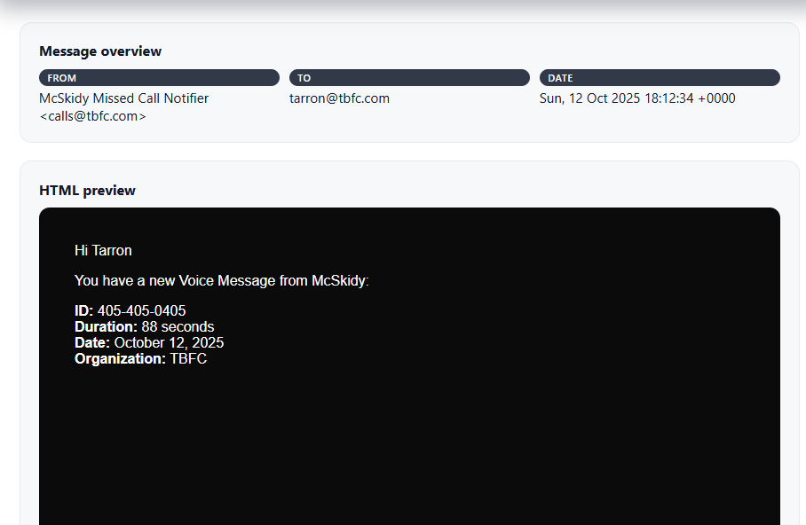
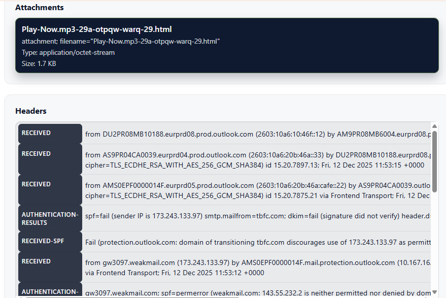
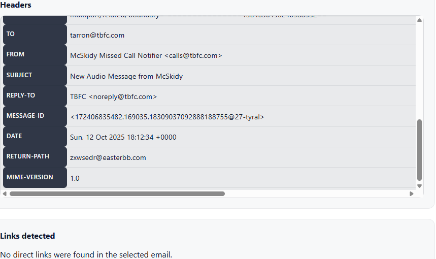

# Phishing Email Analysis Report

## Overview
This report analyzes a suspicious email identified using the **Wareville Email Threat Inspector** from TryHackMe.  
The email is assessed as a phishing attempt involving impersonation, spoofing indicators, and a malicious attachment.

---

## Email Details
- **From:** McSkidy Missed Call Notifier <calls@tbfc.com>
- **To:** tarron@tbfc.com
- **Date:** Sun, 12 Oct 2025 18:12:34 +0000
- **Subject:** Missed Call Notification (implied from context)

---
## Phishing Signals Identified

-Impersonation
-Spoofing
-Malicious attachment
---

## Αnalysis

### Impersonation
The email impersonates a legitimate notification service ("Missed Call Notifier") to trick the recipient into interacting with the message.

---
###  Spoofing Indicators
The sender domain "tbfc.com" is used in a misleading context.
---

### malicious Attachment
The email contains a suspicious attachment:

- `Play-Now.mp3-29a-otpqw-warq-29.html`
- Type: `application/octet-stream`
- Malicious HTML file disguised as audio content
- Trick the user into interacting with fake content

---

## Indicators of Compromise (IOCs)
- Sender: calls@tbfc.com
- Return-Path mismatch: different domain observed,zxwsedr@easterbb.com
- Attachment: Play-Now.mp3-29a-otpqw-warq-29.html
- MIME Type mismatch: application/octet-stream vs .html
- SPF: FAIL
- DKIM: FAIL
- DMARC: FAIL

---

## MITRE ATT&CK Mapping
:contentReference[oaicite:0]{index=0}

- T1566.001 – Spearphishing Attachment  
- T1204.002 – Malicious File Execution(Possible)  
- T1036 – Masquerading (Fake notifier identity)

---

## Conclusion
The email is a phishing attempt using impersonation and a malicious attachment disguised as a media file.  
User interaction with the attachment may lead to credential theft or malicious page execution.

---

##  Recommendation
- Dont open attachments from unknown sources  
- Block sender domain `tbfc.com` if confirmed malicious  
- Monitor for similar attachment patterns

- ## Phishing Case 1 Analysis

### Email Evidence images

